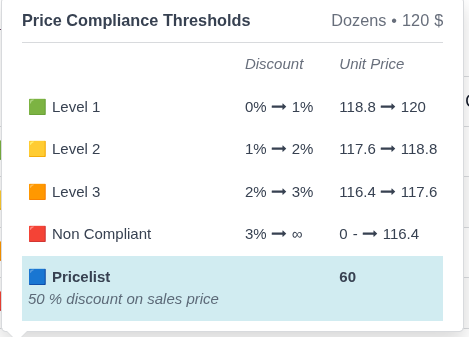
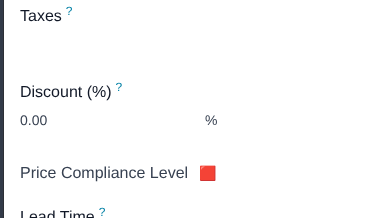
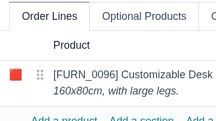
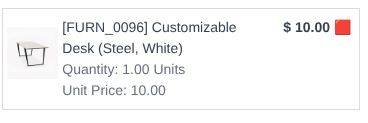

This module extends the sales pricing functionality to display a color code
based on the price at which products are being sold.

Managing Price Compliance Thresholds can be done by adding *Manage Price Compliance*
 group to any user.
Compliance Tiers can be filtered on sale reports.

You can use up to 3 different price compliance tiers for products,
categories or for all company.

You can customize the texts and icons of the tiers via the System Parameters.

Labels of the tier fields will change according to `sale_price_compliance.price_compliance_selection_tiers_text` System Parameter in views.

This functionality only applies to Sales.

A sale with a line with Non Compliant price (doesn't fit in any defined tiers) can't be confirmed.
Only Sale Administrators can validate this sales and a message will be posted.

Price Compliance thresholds are selected in this order: Product > Product Category > Company

Each Tier represents the maximun discount applied to the Price of the Product to achieve the target tier.

**Color Compliance Tiers**
- Tier 1 🟩: High-yield (Fully compliant)
- Tier 2 🟨: Medium-yield (Moderately compliant)
- Tier 3 🟧: Low-yield (Low compliant)
- Non Compliant 🟥: Non Compliant price (blocked)
- Pricelist 🟦: Pricelist has been used and it's price is between pricelist and last compliant tier.

**Information Display on Price Compliant Tiers**
Includes a popup to display detailed information about the price ranges
within each price compliance tiers.

Also displays Product Base UoM and Product List Price in Sale Currency in the Top Right corner of the Popup.

